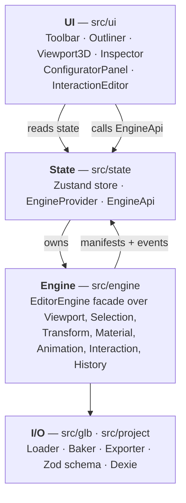

# Universal GLB Configurator

Drop in any `.glb`. The app works out which parts are doors, fans, drawers and switches — then generates working controls for them and bakes the result back into a GLB that behaves the same in any viewer.

No server. No upload. No per-model code.


---

## What it does

Give a normal 3D viewer a GLB of a server rack and it shows you a server rack. Give this one the same file and it tells you which panel is a door, which disc is a fan, which tray slides out — and puts an Open/Close button, a speed slider and an extension scrubber on screen for them.

Nothing in the app knows what a server rack is. It reasons from geometry, hierarchy, naming and baked animation.

| | |
|---|---|
| **Detect** | Classifies every node as `door`, `fan`, `drawer`, `rotating`, `switch`, `animated` or `unknown` — with a confidence score and readable reasons |
| **Configure** | Generates controls for detected parts; nine presets for authoring your own when detection guesses wrong or the model has no animation at all |
| **Correct** | Fixes doors hinged at their centre, doors that swing the wrong way, fans on the wrong axis — without touching vertex data |
| **Ship** | Bakes your configuration into real animation clips and exports a GLB that works in Blender, `<model-viewer>` or any three.js scene |

> **Everything stays local.** The GLB is read with `File.arrayBuffer()` and parsed in the tab. Configurations go to IndexedDB on the same machine. There is no backend and no fetch to anywhere.

---

## Quick start

```bash
npm install
npm run dev        # Vite dev server
npm run build      # tsc -b && vite build
npm run preview    # serve the production build
npm run lint       # eslint
npm test           # vitest run
npm run test:watch
```

Then:

1. Drag a `.glb` onto the viewport, or click **Open GLB**.
2. Open the **Configurator** tab. Detected parts already have controls.
3. Mis-detected? Select the node in the Outliner → **Add Interaction** → pick a preset.
4. Wrong hinge point? Set a pivot mode, or drag the pivot marker with the gizmo.
5. Work autosaves to IndexedDB keyed by the model's content hash — reopen the same GLB and it comes straight back.
6. **Export GLB** bakes everything into clips and downloads a new file.

Requires a WebGL2 browser. Import ceiling is 1 GB per file. Without IndexedDB (some private modes) the editor still works and saving becomes a silent no-op.

---

## Architecture

Three layers, one-way dependency. The engine is plain three.js and knows nothing about React; React knows nothing about three.js.



**The rule that makes it work:** React state holds descriptions, not objects. The scene graph holds objects, not descriptions. Whenever the engine mutates the scene it emits plain data — `NodeEntry[]`, `MaterialEntry[]`, `InteractionDefinition[]` — that the store merges. That is why clicking a mesh in the viewport lights up the Outliner, and dragging the gizmo updates the Inspector, without either component ever touching an `Object3D`.

### Import pipeline

```
validate → parse + hash → scan structure → scan motion → classify → baseline + frame
GLBLoader   GLTFLoader     ModelScanner    AnimationScanner  SemanticDetector  EditorEngine
            FNV-1a                                          CapabilityManifest
```

### Layout

```
src/
  engine/          plain three.js — no React anywhere below this line
    scanner/       gltf.scene → serializable manifest
    animation/     clip playback + per-track motion analysis
    semantic/      weighted-evidence classifier
    capability/    structure + motion + semantics, merged
    interaction/   JSON behaviour definitions, pivots, presets
    commands/      undo stack
  state/           Zustand store + the engine bridge
  ui/              React components
  glb/             loader, exporter, animation baker
  project/         Zod schema, diffing, Dexie storage
```

---

## Detection

Deterministic, weighted-evidence classification. No ML. Every rule records a sentence explaining itself, and those sentences surface in the UI — a detection can always be questioned.

| Source | Example rule | Weight | Votes for |
|---|---|---:|---|
| Name | Own name token matches the vocabulary | +0.30 | that type |
| Hierarchy | Child named `handle` / `hinge` / `blade` | +0.12 | door / fan |
| Shape | Thinnest axis under 25% of the longest | +0.10 | door |
| Animation | Cyclic rotation ≥ 300° | +0.45 | rotating |
| Animation | Cyclic rotation ≥ 300° | −0.30 | door *(against)* |
| Animation | Rotation sweep 15°–200° | +0.35 | door |
| Animation | Origin over 25% off its bounding-box centre | +0.15 | door |
| Animation | Slides > 15% of its own extent | +0.40 | drawer |

Two guardrails keep it honest:

- **Name-only confidence is capped at 0.35.** Plenty of meshes are called `Cube.003`; plenty of things called `panel` are welded shut. Without animation-sourced evidence, no guess is presented as confident.
- **Ambiguous types need naming or hierarchy support.** A 45° swing could be a door, a lever or a hinge bracket, so `door`, `fan`, `drawer` and `switch` need a second source. `rotating` is exempt — a full revolution is mechanically unambiguous.

---

## Interactions

An interaction is pure JSON — no functions, no `Object3D` references — so it serializes untouched into the project file and can be replayed in any three.js scene.

| Kind | Behaviour |
|---|---|
| `rotateBetween` | Eases rotation between two angles about one axis |
| `translateBetween` | Slides along one axis, in model units |
| `continuousSpin` | Integrates an angle per frame; live speed and direction |
| `playAnimation` | Binds a control to clips already in the GLB |
| `toggleVisibility` | Shows/hides the target set |
| `transform` | Interpolates full TRS between two saved states |

Presets: **Door**, **Fan / Spin**, **Drawer / Slider**, **Button / Switch**, **Lever**, **Generic Rotation**, **Generic Translation**, **Existing Animation**, **Show / Hide**.

Motion is always written relative to the rest pose captured when the interaction was bound, so repeated edits never accumulate drift.

### Pivots without re-modelling

Most exported doors rotate around their own centre because nobody moved the origin. `PivotService` inserts a proxy `Group` at the desired hinge point and calls `Object3D.attach()`, which preserves world matrices — **nothing moves on screen**, only the origin of future rotations changes. That proxy becomes the *driver*: what interactions rotate, and what baked tracks target on export.

Modes: `original` · `center` · `left` · `right` · `top` · `bottom` · `custom` (drag a marker with the gizmo).

---

## Project files

A project is a **diff against the imported GLB**, validated by Zod on write and read. The binary is never embedded — the model is referenced by name, size and FNV-1a content hash.

```jsonc
{
  "version": 1,
  "model":   { "fileName", "fileSize", "hash", "objectCount", "clipCount" },
  "objects": { "<stableId>": { "name?", "visible?", "position?", "quaternion?",
                               "scale?", "materialSlots?" } },
  "materials": { "<index:name>": { "color?", "metalness?", "roughness?" } },
  "interactions": [ /* InteractionDefinition */ ],
  "semanticOverrides": { "<stableId>": { "type", "status" } },
  "pivots": { "<interactionId>": { "mode", "point?" } },
  "editor": { /* grid, gizmo, snapping, material scope */ },
  "camera": { "position", "target", "fov", "near", "far" }
}
```

**Why stable ids:** three.js hands out fresh uuids on every parse, so a uuid written to disk is meaningless next time. Objects are keyed by their child-index path from the scene root (`2/0/1`); materials, which have no path, by `index-in-scan-order:name`.

Autosave is debounced 900 ms into IndexedDB (Dexie), one configuration per model hash. Projects also export as pretty-printed JSON. Anything missing on restore produces a warning, never an exception — a stale project degrades, it never bricks the editor.

---

## Export

1. Every interaction resets to its rest pose — the file captures the model at rest, not mid-swing.
2. Definitions are sampled into keyframe tracks at **24 fps**, targeting the *driver* uuid so pivot proxies come along.
3. Spins export as one full 360° revolution whose duration follows the configured speed — loopable anywhere.
4. Clips replaced via `overrideClipIds` are dropped, so the file never contains both old motion and its replacement.
5. Originals + baked clips go to `GLTFExporter` in binary mode.

Warnings are reported, e.g. *"2 original clip(s) replaced by manual interactions"*.

---

## Keyboard

| | | | |
|---|---|---|---|
| <kbd>W</kbd> Move | <kbd>E</kbd> Rotate | <kbd>R</kbd> Scale | <kbd>X</kbd> World/local |
| <kbd>Q</kbd> Gizmo on/off | <kbd>F</kbd> Focus selected | <kbd>A</kbd> Frame model | <kbd>Esc</kbd> Deselect |
| <kbd>Ctrl</kbd>+<kbd>Z</kbd> Undo | <kbd>Ctrl</kbd>+<kbd>Shift</kbd>+<kbd>Z</kbd> Redo | | |

Suppressed while a text field has focus.

---

## Testing

```bash
npm test
```

Eleven Vitest suites cover the scanners, the classifier, the capability manifest, the interaction engine, the pivot service, the material service, the animation manager, the command history, the baker, the project schema round-trip, and the store.

Dev builds expose read-only introspection on `window`: `__engineDebug()`, `__capDebug()`, `__matDebug()`, `__nodeDebug(name)`, `__gizmoDebug()`, `__interactionDebug()`, `__projectDebug()`. All guarded by `import.meta.env.DEV`; no production behaviour depends on them.

---

## Known limits

| Limit | Notes |
|---|---|
| Draco / KTX2 | Detected and reported clearly, but the decoders are not attached |
| `.glb` only | Separate `.gltf` + `.bin` pairs are rejected at the extension check |
| Logical groups | In the schema, always written empty — grouping uses `extraTargetIds` today |
| Visibility toggles | Editor-only; no keyframe equivalent, so they are not baked |
| One model at a time | Importing replaces; the previous model is fully disposed |

---

## Documentation

Full technical manual — every threshold, preset default, schema field and extension point — is in **[`MANUAL.txt`](MANUAL.txt)**.

Extending it in short:

- **New semantic type** — add to `SemanticType` + the schema enum, add vocabulary to `VOCAB`, push animation evidence in `addAnimationEvidence()`, map it in `categoryFor()` and `buildInteractions()`.
- **New preset** — add to `InteractionPreset` + the schema enum + `PRESETS`, return defaults from `createInteractionFromPreset()`, and handle any new config kind in `InteractionEngine.apply()`, `tick()` and `buildBakedClips()`.
- **Reuse the engine** — `InteractionEngine` needs only an `id → Object3D` resolver and an optional animation bridge. Saved definitions replay in any three.js scene without importing the editor.
